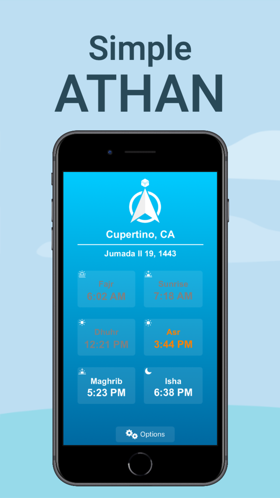

# Simple Athan

## Link to Simple Athan on the [iOS App page](apps.apple.com/us/app/simple-athan/id1594780073?itsct=apps_box_link&itscg=30200)

### ​Welcome!
​
Over the past 1.5 years, I developed an iOS Application that utilizes many aspects of engineering concepts to create a dynamic user experience for all. This app uses geolocation services, API retrievals, WidgetKit, and custom algorithms to provide accurate data for users located anywhere in the United States. 

## Current Features Include:
- Elegant main screen UI which highlights current day's prayer times
- Calculation of accurate prayer times based on current location
- Calculation of current Hijri date and displayed on main screen
- Accurate Qibla pointer displayed on main screen
- Highlight of current prayer and grayed-out finished prayers on main screen
- Widgets available for use on the homescreen (medium and small)
- Toggle between Hanafi or Shaafi for jurisprudence to determine Asr time
- Selection of multiple popular calculation standards to determine prayer times
- Selection of manual adjustment in minutes for each individual prayer
- Adjustment of prayer angles for Fajr, Maghrib, and Isha
- Toggle prayer notification alerts for all prayers
- Toggle prayer notification sounds for all prayers
- Reset all options to default configuration
- Simplistic and sleek UI designs across the App
- Absolutely zero data collection or ads anywhere within the App

## Gallery

